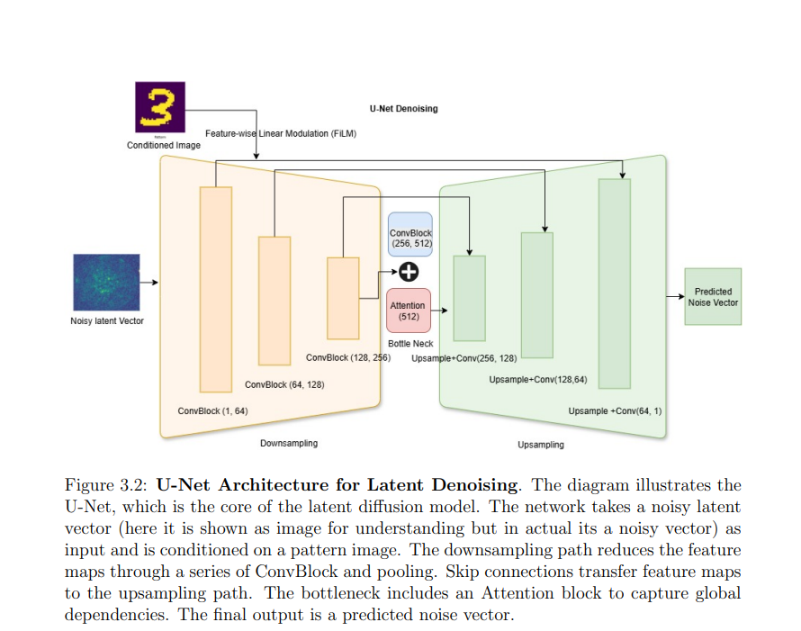
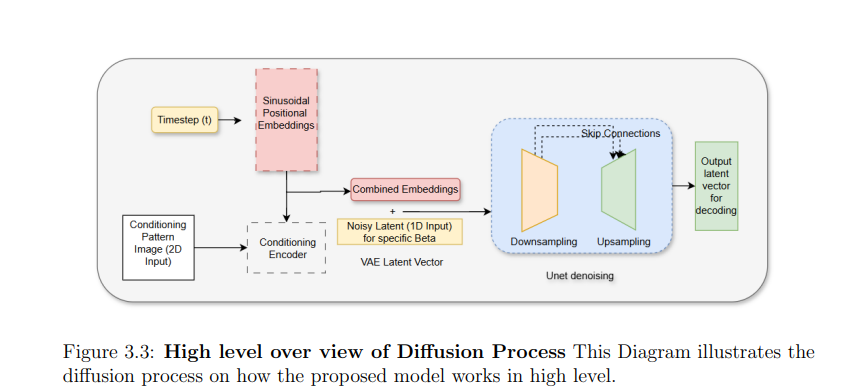

# Variational Autoencoder (VAE)

This repository contains an implementation of a Variational Autoencoder (VAE) model designed to isolate important latent variables from training data and reconstruct input images via a probabilistic latent space.

## 📚 Overview

A Variational Autoencoder (VAE) is a generative model that learns a probability distribution over latent variables and uses it to generate or reconstruct data. Unlike standard Autoencoders that encode input to a fixed latent vector, VAEs encode inputs as a **distribution** defined by a mean (µ) and variance (σ²). The model is trained to minimize both the reconstruction error and the Kullback-Leibler (KL) divergence between the learned latent distribution and a prior distribution (usually a standard normal distribution).

This implementation includes:
- An **Encoder** using ResNet blocks and convolutional layers
- A **Decoder** using transposed convolutions
- A **latent space** of dimension `dz = 512`
- A loss function combining **MSE** and **KL Divergence** with a weighting factor β

---

## 🧠 Architecture

### Encoder
- 4 convolutional layers with ResNet blocks
- Kernel size: 3×3
- Stride: 2
- Activation: SiLU
- Two fully connected layers outputting:
  - Mean vector `µ`
  - Log-variance vector `log σ²`

### Reparameterization Trick
This technique allows backpropagation through the sampling process from the latent distribution.

$$z = µ + ε \cdot \sigma, \quad \text{where } ε \sim N(0, 1)$$

### Decoder
- 4 transposed convolutional layers to upsample the latent vector
- Kernel size: 3×3
- Stride: 2
- Activation: SiLU
- Final layer uses a Sigmoid activation to output pixel values in the range [0, 1]

---

## ⚖️ Loss Function

The VAE loss function, also known as the **Evidence Lower Bound (ELBO)**, is a critical component for training. It consists of two terms that are balanced to ensure both accurate reconstruction and a well-structured latent space.

$L_{VAE} = L_{reconstruction} + β \cdot L_{KL}$

### 1. Reconstruction Loss ($L_{reconstruction}$)
This term measures how well the decoder reconstructs the original input image from the sampled latent vector. It's a standard loss function for reconstruction tasks.

- **Objective:** To minimize the difference between the input image ($x$) and the reconstructed image ($x_{recon}$).
- **Formula:** Mean Squared Error (MSE) is commonly used for continuous data, such as images.

### 2. KL Divergence Loss ($L_{KL}$)
This term acts as a regularizer. It measures the "distance" between the learned latent distribution and a standard normal distribution, forcing the latent space to be well-organized and continuous.

- **Objective:** To constrain the encoder's output to follow a standard normal distribution (mean=0, variance=1).
- **Formula:** For a Gaussian latent distribution, the KL divergence has a closed-form solution:

$$L_{KL} = -0.5 \sum_{i=1}^{dz} (1 + \log(\sigma^2_i) - \mu^2_i - \sigma^2_i)$$

My original VAE was too shallow and simple to capture the necessary details of the
speckle images.
Architectural Upgrades
• I made the VAE much deeper to increase its capacity.
• I incorporated ResNet blocks to ensure the new, deeper model could train stably.
• Exploding Gradients: Solved by implementing gradient clipping and using a
stable learning rate (1 × 10−4).
• Posterior Collapse: Solved by adjusting the β (beta) value in the loss function
to force the model to prioritize reconstruction.
The Beta Trade-Off was the most crucial insight. I discovered the fundamental trade-off between reconstruction quality and latent space usability and methodically
tuned β to find the ”sweet spot.”
- **Weighting Factor ($β$):** The parameter $β$ can be tuned to balance the trade-off between reconstruction quality and the regularity of the latent space.

---
